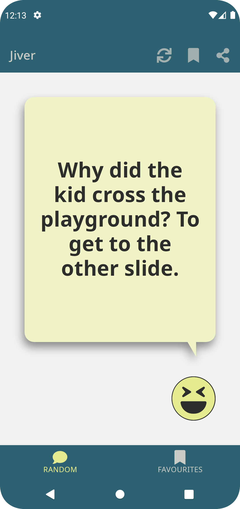
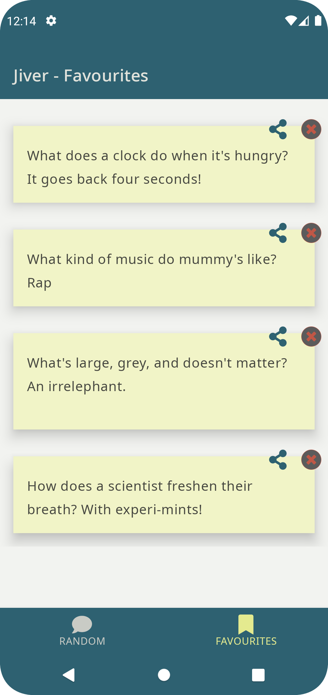

# jokeapp

a small app to request a joke from [iCanHazDadJoke](https://icanhazdadjoke.com)

| Random | Favorites |
| --- | --- |
|  |  |

## analysis

### ui requirements

- random joke in big font
- action button to add/remove favourites
- action button to share joke
- bottom buttons to sync and view favourites
- favourites a card list

## design

### architecture

- uncle bob's clean architecture in modular android
- separation of data, domain and presentation layers
- redux with reducers and middleware for viewmodel state
- compose and material ui frameworks
- kotlin state flow and coroutines
- navigation with routing and notifications
- per-screen headers and footers
- random joke prefers network, and save to local cache
- categorized repository IO: `asyncronous`, `syncronous`, `observable`, `local`, and `remote`

## implementation

### project layout

#### clean architecture

- **domain**: business entities, interfaces and use cases between layers
- **data**: implementation of categorized data storage and retrieval
- **ui**: presentation of data and user interaction

#### custom

- **app**: the entry point to the application
- **meta**: code related to programming languages, frameworks or algorithms
- **test**: all unit tests and instrumented tests
- **vendor**: third party project files

### tests

- rules and/or injection to handle threading and coroutines
- fake data generator
- mocking and mock network server
- in-memory database
- user interface tag verifications

## maintenance

### TODO:

- [x] improve stock UX
- [ ] abstract to clean-architecture template
- [ ] generalize and add new remote sources, like quotes
- [ ] export to photo for sharing
- [ ] analytics
- [x] fix snackbar
- [ ] allow user to add content
- [ ] device home screen widget
- [ ] multiplatform (pending kotlin multiplatform release)
- [ ] splash screen and logo
- [x] speech bubbles
- [ ] ML to know sentiment of joke and predict favorites
- [ ] speech bubble characters based on category or sentiment
- [ ] Text-to-speech, laugh track
- [ ] Animations
- [ ] monetize
- [ ] security analysis
